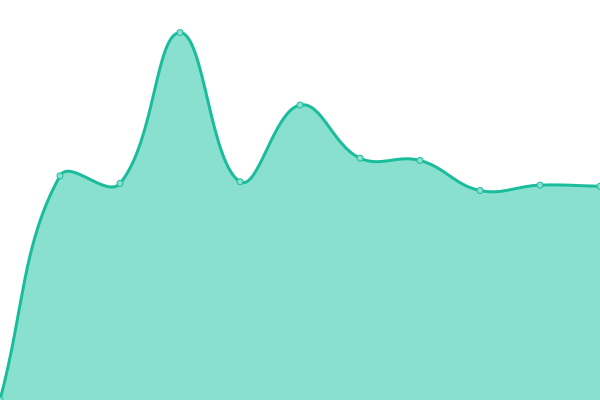

# [📈 Live Status](https://qtekfun.github.io/upptime): <!--live status--> **🟩 All systems operational**

This repository contains the open-source uptime monitor and status page for [Cipriano M.](https://qtekfun.github.io/upptime), powered by [Upptime](https://github.com/upptime/upptime).

With [Upptime](https://upptime.js.org), you can get your own unlimited and free uptime monitor and status page, powered entirely by a GitHub repository. We use [Issues](https://github.com/qtekfun/upptime/issues) as incident reports, [Actions](https://github.com/qtekfun/upptime/actions) as uptime monitors, and [Pages](https://qtekfun.github.io/upptime) for the status page.

<!--start: status pages-->
<!-- This summary is generated by Upptime (https://github.com/upptime/upptime) -->
<!-- Do not edit this manually, your changes will be overwritten -->
<!-- prettier-ignore -->
| URL | Status | History | Response Time | Uptime |
| --- | ------ | ------- | ------------- | ------ |
|  [Mr. Moviliano](https://mrmoviliano.com) | 🟩 Up | [mr-moviliano.yml](https://github.com/qtekfun/upptime/commits/HEAD/history/mr-moviliano.yml) | 

 3266ms
     
 | 

<a href="https://qtekfun.github.io/upptime/history/mr-moviliano">99.85%</a>
    

|  [Ocio En Femenino](https://www.ocioenfemenino.com/) | 🟩 Up | [ocio-en-femenino.yml](https://github.com/qtekfun/upptime/commits/HEAD/history/ocio-en-femenino.yml) | 

 1346ms
     
 | 

<a href="https://qtekfun.github.io/upptime/history/ocio-en-femenino">100.00%</a>
    

|  [La Mejor Tele](https://www.lamejortele.com/) | 🟩 Up | [la-mejor-tele.yml](https://github.com/qtekfun/upptime/commits/HEAD/history/la-mejor-tele.yml) | 

 1486ms
     
 | 

<a href="https://qtekfun.github.io/upptime/history/la-mejor-tele">100.00%</a>
    

|  [Opinión Televisión](https://opiniontelevision.com/) | 🟩 Up | [opinion-television.yml](https://github.com/qtekfun/upptime/commits/HEAD/history/opinion-television.yml) | 

 2043ms
     
 | 

<a href="https://qtekfun.github.io/upptime/history/opinion-television">100.00%</a>
    

|  [Qtekfun](https://qtekfun.com/) | 🟩 Up | [qtekfun.yml](https://github.com/qtekfun/upptime/commits/HEAD/history/qtekfun.yml) | 

 253ms
     
 | 

<a href="https://qtekfun.github.io/upptime/history/qtekfun">100.00%</a>
    

|  [Qtekfun Temp](https://qtekfun.netlify.app/) | 🟩 Up | [qtekfun-temp.yml](https://github.com/qtekfun/upptime/commits/HEAD/history/qtekfun-temp.yml) | 

 78ms
     
 | 

<a href="https://qtekfun.github.io/upptime/history/qtekfun-temp">100.00%</a>
    

|  [NH](https://www.noeliahontoria.com/) | 🟩 Up | [nh.yml](https://github.com/qtekfun/upptime/commits/HEAD/history/nh.yml) | 

 1267ms
     
 | 

<a href="https://qtekfun.github.io/upptime/history/nh">100.00%</a>
    

|  [Testamentaria](https://testamentaria.com) | 🟩 Up | [testamentaria.yml](https://github.com/qtekfun/upptime/commits/HEAD/history/testamentaria.yml) | 

 5396ms
     
 | 

<a href="https://qtekfun.github.io/upptime/history/testamentaria">100.00%</a>
    

|  [ComidistaFoodie](https://comidistafoodie.com) | 🟩 Up | [comidista-foodie.yml](https://github.com/qtekfun/upptime/commits/HEAD/history/comidista-foodie.yml) | 

 163ms
     
 | 

<a href="https://qtekfun.github.io/upptime/history/comidista-foodie">100.00%</a>
    

<!--end: status pages-->

[**Visit our status website →**](https://qtekfun.github.io/upptime)

## 📄 License

- Powered by: [Upptime](https://github.com/upptime/upptime)
- Code: [MIT](./LICENSE) © [Cipriano M.](https://qtekfun.github.io/upptime)
- Data in the `./history` directory: [Open Database License](https://opendatacommons.org/licenses/odbl/1-0/)
